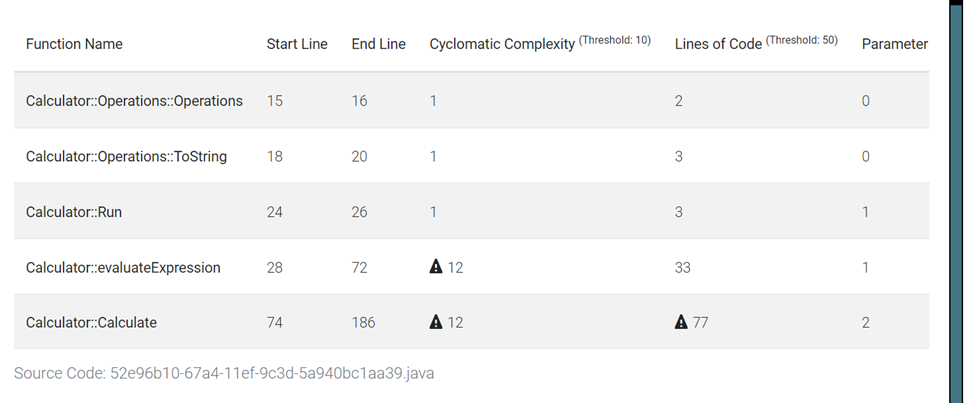
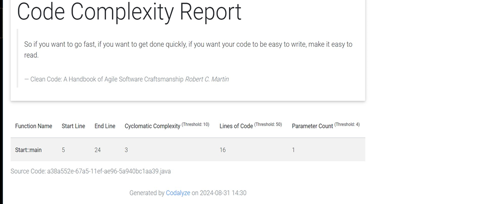

# Izveštaj 
#### Metrika, pregled i statička analiza 
#### projekta Calculator.java

### Fajl Calculator.java
----
#### LOC: 
**Broj linija koda je ručno urađen.**

Fajl ima ukupno 188 linija, od kojih je:
 - 129 linija sa kodom, 
 - 5 linija su komentari i 
 - 54 linija su bez koda.

**Ukupan broj linija koda u projektu je 214.**

#### Ciklomatska kompleksnost:
**Korišćen je alat Codalyze**

Slika br. 1 prikazuje Codalyze report fajla Calculator.java

Ciklomatska složenost metoda Operation, ToString i Run je 1, što znači da je kod jednostavan i lak za održavanje.
Ciklomatska složenost metoda evaluateExpression i calculate je 12, što znači da je kod komplikovan i težak za održavanje. 

#### Kognitivna kompleksnost:
**Kognitivna složenost je ručno urađena i iznosi 31:**
-  za kontrolu toka(for petlja i uslovni blokovi if…else) kognitivna složenost iznosi 22
-  zbog bloka za obradu izuzetka dodat je 1 bod  
-  zbog rekurzije, tj. poziva funkcije Calculate(numbers,operations) još 8 bodova.

#### Statička analiza
**Za statičku analizu korišćeno je razvojno okruženje InteliJ IDEA.**

Zapažaju se 3 značajnija upozorenja u kodu i 3 upozorenja koja su od manjeg značaja. 
Značajnija upozorenja su:
- Linija 53: “for” petlja može da bude zamenjena sa unapređenom for petljom.
- Linija 70: lokalna promenljiva “textResult” je nepotrebna.
- Linija 183: “return” naredba nije potebna, jer je u pitanju void metoda koja ništa ne vraća. 

Što se tiče upozorenja koji su manjeg značaja,  razvojno okruženje je sugerisalo sledeće:
- Linija 39: moguće je izdvojiti metodu koja vraća “operationList” iz okruženja
- Linije 87 I 138: zajednički deo se može izvući iz “if”

  ### Fajl: Start.java
---
#### LOC:
Fajl ima ukupno 26 linija koda, od toga: 
- 7 linija bez koda 
- 19 linija sa kodom.
#### Ciklomatska kompleksnost
Ciklomatska kompleksnost je 3, a to znači da je kod jednostavan i lak za održavanje.

Slika br. 2 prikazuje Codalyze report fajla Start.java

#### Kognitivna kompleksnost
Kongnitivna složenost iznosi 4. Radi se o jednoj while perlji u okviru koje imamo if…else uslovni blok. 

#### Statička analiza
Što se tiče statičke analize, razvojo okruženje InteliJ IDEA nije sugerisalo da u ovom fajli ima nekih značajnijih upozorenja. 

